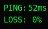
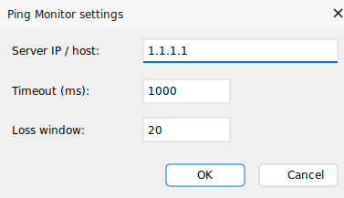
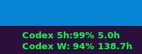
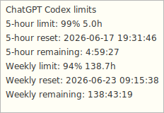

# TrafficMonitor Plugin Collection by Anigx

This repository contains standalone plugins for [TrafficMonitor](https://github.com/zhongyang219/TrafficMonitor).

## Plugins

| Plugin | Display items | Purpose |
| --- | --- | --- |
| Ping Monitor | `PING:`, `LOSS:` | Shows ICMP latency and packet loss for a configured host. |
| Codex Limit Monitor | `Codex 5h:`, `Codex W:` | Shows OpenAI Codex 5-hour and weekly usage limits in the taskbar. |

## Releases

Download prebuilt DLL packages from the [GitHub Releases page](https://github.com/Anigx/TrafficMonitor-Plugin-Collection/releases).

Each release ZIP contains only the plugin DLL. Copy the DLL into TrafficMonitor's `plugins` folder and restart TrafficMonitor.

## General Installation

1. Download the matching plugin ZIP from Releases.
2. Extract the DLL.
3. Copy the DLL into the `plugins` folder next to `TrafficMonitor.exe`.
4. Restart TrafficMonitor.
5. Open `More Functions` -> `Plugin Management` to confirm that the plugin is loaded.
6. Open the taskbar or main-window display settings and enable the plugin items you want to show.

Use the plugin DLL that matches your TrafficMonitor architecture. For example, x64 TrafficMonitor needs an x64 plugin DLL.

## Ping Monitor Plugin

Ping Monitor adds two separately configurable display items for monitoring a server from the desktop window and the taskbar window.

### Features

- `PING:` shows the current ping latency in milliseconds.
- `LOSS:` shows recent packet loss as a percentage.
- The latency and packet loss items can be enabled or disabled separately.
- Hover information shows the target server, last result, recent loss window, total sent packets, total lost packets, and timeout.
- The plugin options dialog lets you set the server IP or host name, timeout, and packet-loss sample window.

### Screenshots

Ping latency and packet loss display:



Plugin settings dialog:



### Settings

Open the plugin options from TrafficMonitor's plugin management dialog. The following values can be changed:

- `Server IP / host`: the target to ping, for example `1.1.1.1`, `8.8.8.8`, or a host name.
- `Timeout (ms)`: ping timeout in milliseconds. Values are clamped to `200` through `5000`.
- `Loss window`: number of recent samples used for packet loss. Values are clamped to `5` through `100`.

The same settings are stored in the plugin INI file:

```ini
[config]
ping_target=1.1.1.1
ping_timeout=1000
ping_window_size=20
```

### Notes

- The plugin uses Windows ICMP APIs, so the target network must allow ICMP echo requests.
- A timeout or failed ping is counted as packet loss.

## Codex Limit Monitor Plugin

Codex Limit Monitor shows OpenAI Codex usage limits directly in the TrafficMonitor taskbar window.

### Features

- `Codex 5h:` shows the remaining 5-hour Codex limit percentage and remaining hours.
- `Codex W:` shows the remaining weekly Codex limit percentage and remaining hours.
- The tooltip shows reset timestamps and full countdowns for both limits.
- Values are aligned with custom drawing so the percentages start in the same visual column.
- The plugin queries Codex in a background worker and does not block TrafficMonitor.

### Screenshots

Taskbar display:



Tooltip details:



### Requirements

- TrafficMonitor for Windows.
- OpenAI Codex CLI installed and available in `PATH`.
- Codex CLI logged in with ChatGPT authentication.

Check Codex from a terminal:

```powershell
codex doctor
```

### How It Works

- The plugin starts a background worker at most once every 5 minutes.
- The worker calls Codex through the local app-server protocol.
- It sends `account/rateLimits/read` to `codex app-server --stdio`.
- Codex CLI handles authentication. The plugin does not read or store access tokens.
- If Codex is slow or unavailable, the last known values remain visible.

### Fallback Data

If automatic Codex querying fails, the plugin can read fallback values from:

```text
%USERPROFILE%\.codex\codex_status.txt
```

Example content:

```text
5h limit: 99% left (resets 19:09)
Weekly limit: 94% left (resets 09:15 on 23 Jun 2026)
```

The plugin options dialog can also store manual values in its INI file.

### Troubleshooting

- If the taskbar shows `--% --h`, run `codex doctor` and make sure Codex is logged in.
- If values do not update immediately, wait up to 5 minutes or restart TrafficMonitor.
- If colors look wrong, configure plugin item colors in TrafficMonitor's taskbar color settings.

## Building From Source

Build individual plugin projects with Visual Studio 2022 or MSBuild.

Example x64 Release builds:

```powershell
msbuild PingMonitorPlugin\PingMonitorPlugin.vcxproj /p:Configuration=Release /p:Platform=x64 /m
msbuild CodexLimitPlugin\CodexLimitPlugin.vcxproj /p:Configuration=Release /p:Platform=x64 /m
```

Output paths:

```text
Bin\x64\Release\plugins\PingMonitorPlugin.dll
Bin\x64\Release\plugins\CodexLimitPlugin.dll
```

## Project Notes

- These plugins are independent from `PluginDemo`; the demo project is not required to use them.
- The repository is intended as a small TrafficMonitor plugin collection, not a fork of the main TrafficMonitor application.
